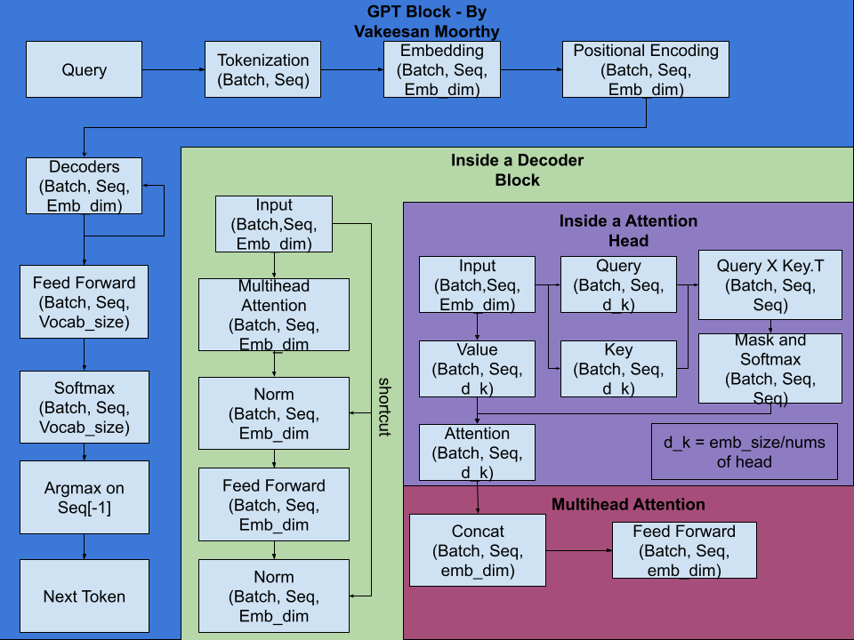

# GPT-1 from Scratch (PyTorch)

A from-scratch PyTorch implementation of GPT-1, based on the original paper **["Improving Language Understanding by Generative Pre-Training"](https://cdn.openai.com/research-covers/language-unsupervised/language_understanding_paper.pdf)** (Radford et al., OpenAI, 2018).

This project implements the core building blocks of the GPT-1 architecture from the ground up — no high-level transformer libraries — and trains a small model on a corpus of short stories to validate the implementation end-to-end.

Link to Live Demo: https://huggingface.co/spaces/VakeesanM/GPT1_Demo

## Features

- **Byte Pair Encoding (BPE)** 
- **Positional Encoding**
- **Masked Multi-Head Self-Attention**
- **Transformer Decoder Blocks** (pre-LN/post-LN feed-forward + residual connections, as in the original architecture)
- **Temperature-controlled sampling** for text generation
- **Top-K sampling** for text generation
- Configurable model size (layers, heads, embedding dimension, context length)
## Config

- Context Length: 128
- Vocab Size: 50257
- Embedding Dim: 300
- Number of Attention Heads: 12
- Number of Decoders: 12
- Total parameters: 78,683,357

## Dataset

- ~11,000 short stories
- Each story capped at 128 words
- Trained for **15 epochs**
- Dataset taken from "https://huggingface.co/datasets/roneneldan/TinyStories"

> Note: This is a small-scale reproduction meant for learning and experimentation, not a faithful reproduction of the original GPT-1's scale (which was trained on the BooksCorpus dataset with ~117M parameters).


## Installation

```bash
git clone https://github.com/VakeesanM/GPT1-Paper-Implementation.git
cd "GPT1-Paper-Implementation"
pip install -r requirements.txt
```

## Usage

### Run The App

```bash
python -m streamlit run "GPT/app.py"
```

The `temperature` flag controls sampling randomness:
- Lower values (e.g. `0.2`) → more deterministic, repetitive text
- Higher values (e.g. `1.2`) → more diverse, riskier text

## Architecture Overview

Following the GPT-1 paper, the model is a **decoder-only Transformer**:

1. Input tokens → token embeddings + positional embeddings
2. 12 stacked decoder blocks, each with:
   - Masked multi-head self-attention with 12 Heads
   - Residual connection + layer normalization
   - Position-wise feed-forward network
   - Residual connection + layer normalization
3. Final linear layer projecting to vocabulary logits

The model is trained with a standard **causal language modeling objective** (next-token prediction).



## Example Output

```
Prompt: "There was a Dragon"
Generated: "There was a dragon. He was very happy and he loved to play in the park. One day, he saw a big tree and he wanted to..."
```
## Future Improvements

- Scale up dataset size 
- Add checkpointing and resume-from-checkpoint support
- Experiment with longer context windows

## References

- Radford, A. et al. (2018). *Improving Language Understanding by Generative Pre-Training.* OpenAI.
- Vaswani, A. et al. (2017). *Attention Is All You Need.*

